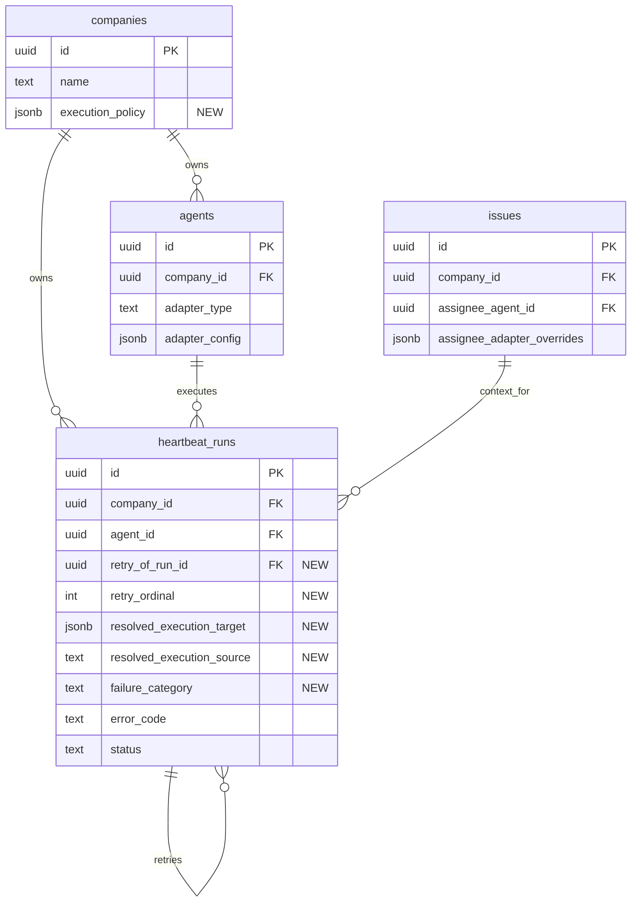

# feat: Company execution policy with rate-limit failover

## Overview

Add a company-owned execution policy that lets the board define a primary execution target and an optional fallback chain for that company. The policy must support two operating modes:

1. `default`: the company target is used only when an agent does not have its own explicit execution target.
2. `override`: the company target temporarily wins over agent-level execution targets for newly started runs.

The first operator outcome is fleet-wide switching without editing every agent. The second is narrow resilience: if a run fails because of a classified quota or rate-limit condition, Paperclip creates a linked retry run against the next configured fallback target.

This is a core control-plane feature, not a plugin feature.

## Problem Statement

Paperclip already stores agent execution identity directly on each agent and resolves issue-level adapter overlays during heartbeat execution. That makes per-agent setup straightforward, but it creates an operational gap:

- there is no company-scoped default execution target
- there is no fleet-wide override for new runs
- there is no structured failure category for safe failover
- there is no retry lineage model for visible fallback attempts

Today, switching a company from one provider/model to another requires editing agents individually. If one provider exhausts quota, the board has no single control-plane switch. The current heartbeat flow also stores only `errorCode` and raw error text, which is not reliable enough to decide whether a retry is safe.

## Research Summary

### Brainstorm Context

The source brainstorm already resolves the main product choices:

- company scope, not instance scope
- core platform feature, not plugin-owned
- `default` and `override` modes are both required
- failover is restricted to quota/rate-limit conditions only
- fallback attempts must be visible as separate linked runs

### Existing Repo Patterns

- `packages/db/src/schema/companies.ts:3-27` already holds company-wide governance settings on the `companies` row, so execution policy belongs there too.
- `packages/shared/src/validators/company.ts:12-20` and `server/src/routes/companies.ts:100-132` already use `PATCH /api/companies/:companyId` for company settings updates.
- `ui/src/pages/CompanySettings.tsx:24-467` already follows a sectioned company-settings pattern with focused cards and inline mutations.
- `packages/shared/src/types/issue.ts:47-50` shows issue-level assignee overrides are currently config overlays, not full cross-adapter execution targets.
- `packages/adapter-utils/src/types.ts:35-56` defines the shared adapter execution result contract, which is the correct seam for introducing structured failure categories.
- `server/src/services/heartbeat.ts:1346-1450` currently resolves execution from agent config plus issue-level adapter overrides, then persists run outcome and `errorCode`, but there is no company execution resolution or retry/fallback taxonomy yet.

### Learnings And Constraints

- Company scoping is a hard invariant across the product and must remain explicit in all new data and routes.
- Adapter config and control-plane policy are intentionally separate concepts. The company policy should select a target, not become a second ad hoc agent configuration store.
- Retry behavior must stay narrow. Broad automatic retries would mask auth failures, invalid config, broken prompts, and adapter bugs.
- Secret references must remain server-resolved and redacted in logs, run metadata, activity events, and UI.
- Capability differences matter. `process` and `http` adapters do not offer the same structured diagnostics or session semantics as resumable local adapters.

### External Research Decision

Skipped. The repo already has strong local patterns for company-scoped settings, adapter contracts, and heartbeat orchestration, and this feature is primarily an internal control-plane change rather than a third-party integration question.

## Proposed Solution

Introduce a structured company execution policy and make heartbeat execution resolve a run target through an explicit precedence model.

### Policy Shape

Store the company policy as a JSON object on `companies.execution_policy`.

```json
{
  "mode": "default",
  "target": {
    "adapterType": "claude_local",
    "adapterConfig": {
      "model": "claude-sonnet-4-6"
    }
  },
  "fallbackChain": [
    {
      "adapterType": "codex_local",
      "adapterConfig": {
        "model": "gpt-5.3-codex"
      }
    }
  ]
}
```

Invalid policy writes must fail at save time with `422`, including:

- unknown adapter types
- structurally invalid target config payloads
- malformed fallback chain entries
- missing primary target when `mode = override`

### Resolution Model

Use this resolution sequence for a newly started run:

1. Determine the base target:
   - company policy target if `mode = override`
   - otherwise the agent's explicit `adapterType` + `adapterConfig` if present
   - otherwise the company policy target if `mode = default`
2. Apply existing issue-level assignee adapter overrides as the highest-priority config overlay on top of the chosen base target.
3. Persist the resolved target and its source onto the `heartbeat_runs` row before adapter invocation.

Resolution is tuple-based, not field-by-field inheritance. Paperclip should choose one base execution target from one layer, then apply issue-level `adapterConfig` overlays only. It should not mix `adapterType` from one layer with `model` or other adapter settings from another layer.

For v1, treat an agent as having an explicit execution target when it has a valid persisted `adapterType`; company `default` mode is only for agents or legacy rows that do not define a usable explicit target. Partial issue overrides merge onto the chosen base target's `adapterConfig` only and never change the selected `adapterType`.

This keeps the current issue overlay behavior intact without pretending issue overrides already support full cross-adapter target replacement.

### Failover Model

When a run fails:

1. The adapter returns a structured `failureCategory`.
2. If the category is `rate_limit` and a fallback target remains, create a new queued `heartbeat_runs` row linked to the failed run.
3. The retry inherits the same company, agent, task context, and wakeup linkage, but stores its own resolved target snapshot.
4. If the failure category is anything else, the run fails normally.

## Technical Approach

### Phase 1: Shared Types And Database Schema

#### 1a. Shared execution policy types

Create a shared execution-policy contract, either in `packages/shared/src/types/company.ts` or a new `packages/shared/src/types/execution-policy.ts`, and export it from `packages/shared/src/index.ts`.

Recommended types:

```ts
export type CompanyExecutionMode = "default" | "override";

export interface ExecutionTarget {
  adapterType: AgentAdapterType;
  adapterConfig: Record<string, unknown>;
}

export interface CompanyExecutionPolicy {
  mode: CompanyExecutionMode;
  target: ExecutionTarget | null;
  fallbackChain: ExecutionTarget[];
}
```

#### 1b. Company type and validator updates

Update:

- `packages/shared/src/types/company.ts`
- `packages/shared/src/validators/company.ts`
- `ui/src/api/companies.ts`

Add:

- `executionPolicy: CompanyExecutionPolicy | null`

Validator requirements:

- `mode` must be `default` or `override`
- `target` may be `null`
- `fallbackChain` defaults to `[]`
- each fallback entry must include `adapterType` and `adapterConfig`
- fallback entries must not contain secret-resolved values, only persisted config or secret refs
- `mode = override` requires a non-null `target`
- every referenced `adapterType` must exist in the registered adapter set or the API returns `422`

#### 1c. Adapter result failure taxonomy

Extend `packages/adapter-utils/src/types.ts` with a shared failure category:

```ts
export type AdapterFailureCategory =
  | "rate_limit"
  | "auth"
  | "timeout"
  | "config"
  | "provider"
  | "unknown";

export interface AdapterExecutionResult {
  // existing fields...
  failureCategory?: AdapterFailureCategory | null;
}
```

This keeps failure classification at the adapter boundary instead of hard-coding provider-specific string heuristics in the heartbeat service.

#### 1d. Company schema

Update `packages/db/src/schema/companies.ts` with:

```ts
executionPolicy: jsonb("execution_policy").$type<Record<string, unknown>>(),
```

Use `null` as the default so existing companies retain current behavior until explicitly configured.

#### 1e. Heartbeat run lineage and resolution snapshot

Update `packages/db/src/schema/heartbeat_runs.ts` with fields that preserve what target actually ran and how retries relate:

```ts
retryOfRunId: uuid("retry_of_run_id").references((): AnyPgColumn => heartbeatRuns.id, { onDelete: "set null" }),
retryOrdinal: integer("retry_ordinal").notNull().default(0),
resolvedExecutionTarget: jsonb("resolved_execution_target").$type<Record<string, unknown>>(),
resolvedExecutionSource: text("resolved_execution_source"),
failureCategory: text("failure_category"),
```

`resolvedExecutionTarget` should store the exact target snapshot used for that run. This is what makes "override only affects new runs" observable and auditable.

#### 1f. Migration

Generate a migration after schema changes:

```bash
pnpm db:generate
```



### Phase 2: Heartbeat Resolution And Retry Orchestration

#### 2a. Add a focused resolver

Create a server-side execution-policy resolver, for example:

- `server/src/services/execution-policy.ts`

Responsibilities:

- parse and validate company execution policy
- select the base target for a new run
- apply existing issue assignee adapter overrides as a top-level overlay
- return both the resolved target and its source
- reject unknown adapters instead of silently falling back to the process adapter

Recommended source enum:

- `company_override`
- `agent_explicit`
- `company_default`
- `agent_implicit_legacy`

If the system encounters an invalid company policy, it should fail closed for that run with a clear operator-visible error rather than silently falling back to a different target.

Cross-adapter fallback is allowed in v1 if each referenced adapter is valid. Session continuity is not guaranteed across adapter families because fallback creates a new run attempt, not a resumed session inside the original run.

#### 2b. Resolve target at run start, not wakeup creation

Update `server/src/services/heartbeat.ts` so target resolution happens when a run is claimed and starts execution, not when the wakeup request is first queued.

This clarifies behavior:

- running runs keep their original target
- queued-but-not-started runs use the latest policy when they begin
- changing company override mode does not mutate agent rows or rewrite queued run context snapshots

#### 2c. Persist the resolved target snapshot

Right before adapter invocation, persist:

- `resolvedExecutionTarget`
- `resolvedExecutionSource`
- `retryOrdinal`

The adapter should then be invoked with the resolved target rather than directly from `agent.adapterType` and `agent.adapterConfig`.

This likely requires factoring the current `adapter = getServerAdapter(agent.adapterType)` and `mergedConfig` path in `server/src/services/heartbeat.ts`.

#### 2d. Add structured failure classification

Update adapter packages to set `failureCategory` where possible:

- `packages/adapters/claude-local/src/server/execute.ts`
- `packages/adapters/codex-local/src/server/execute.ts`
- `packages/adapters/cursor-local/src/server/execute.ts`
- `packages/adapters/opencode-local/src/server/execute.ts`
- `packages/adapters/pi-local/src/server/execute.ts`
- `packages/adapters/openclaw-gateway/src/server/execute.ts`

Initial v1 guidance:

- quota exhausted / 429 / rate-limit lockout -> `rate_limit`
- login required / auth token invalid -> `auth`
- hard timeout -> `timeout`
- missing required config -> `config`
- everything else -> `unknown` or `provider`

Do not attempt failover when the adapter cannot classify the failure confidently.

#### 2e. Create linked retry runs

When a run ends with:

- `status = failed`
- `failureCategory = rate_limit`
- a remaining fallback target exists

create a new queued run with:

- same `companyId`
- same `agentId`
- same `contextSnapshot`
- same `wakeupRequestId`
- `retryOfRunId = currentRun.id`
- `retryOrdinal = currentRun.retryOrdinal + 1`
- `resolvedExecutionTarget` prefilled with the selected fallback snapshot, or recomputed immediately on claim from an explicit retry target payload

The original run remains visible as failed. The retry run is a separate row.

Retry initiation semantics:

- automatic fallback uses automation/system semantics and records `contextSnapshot.retryReason = "automatic_fallback"`
- manual retry from the UI remains supported and records `contextSnapshot.retryReason = "manual_retry"`
- both forms of retry should link back through `retryOfRunId`, so run history stays chain-aware

#### 2f. Wakeup and lifecycle handling

Adjust wakeup lifecycle so the original wakeup request is not treated as finally completed until the fallback chain has exhausted or one attempt succeeds.

Requirements:

- retries must not create unbounded new wakeup requests
- live events and run detail views must surface retry lineage
- agent status should remain consistent with current max-concurrency rules
- retry orchestration must respect paused, terminated, pending-approval, and budget-blocked states
- deferred or coalesced wakeups must resolve policy when promoted/claimed, not when first enqueued
- rate-limit-triggered fallback attempts must not count as trust-demotion failures

### Phase 3: Company Settings UI

#### 3a. Add an Execution section to company settings

Extend `ui/src/pages/CompanySettings.tsx` with a new section above Plugins or Approvals:

- policy mode selector: `default` / `override`
- primary target editor
- fallback chain editor
- explicit explanation of what each mode does

Reuse the existing company-settings card layout rather than inventing a new page flow.

#### 3b. Reuse adapter config UI patterns

Build a focused company target editor that reuses the adapter registry and adapter config fields already used by agents.

Likely new UI components:

- `ui/src/components/CompanyExecutionPolicyCard.tsx`
- `ui/src/components/ExecutionTargetEditor.tsx`

The company policy editor should intentionally be narrower than `AgentConfigForm`:

- no identity fields
- no heartbeat policy fields
- only execution target selection and adapter config

#### 3c. Fallback chain UX

Support an ordered list of fallback targets with:

- add fallback
- remove fallback
- reorder up/down
- show adapter label and selected model summary

V1 should keep this functional and clear rather than over-designed.

#### 3d. Safety and clarity

UI requirements:

- show a persistent warning banner when `mode = override`
- explicitly state that override applies to newly started runs only
- make it obvious that fallback only triggers on rate-limit/quota failures
- show empty state text when no company execution policy is configured

### Phase 4: Read Surfaces And Auditability

#### 4a. Agent read surfaces

Add inherited-vs-explicit execution indicators on at least:

- `ui/src/pages/AgentDetail.tsx`
- `ui/src/pages/Agents.tsx` or a shared agent row component

Recommended display:

- `Explicit`
- `Inherited from company`
- `Company override active`

This is operationally important because company-level override should be impossible to miss.

#### 4b. Run detail visibility

Extend run detail or run event views to surface:

- resolved execution source
- resolved adapter/model summary
- failure category
- retry lineage

At minimum, the run API response must expose these fields even if the first UI pass is light.

#### 4c. Activity logging

Write activity log events for:

- company execution policy updated
- company execution mode changed
- fallback retry queued
- fallback chain exhausted

Activity details must not leak secret material from adapter config and should include before/after policy diffs for company policy changes.

## Alternative Approaches Considered

### 1. Instance-wide execution policy

Rejected for v1. Paperclip is multi-company by data model, and this feature is explicitly about company-scoped operational control.

### 2. Bulk rewrite agent configs on switch

Rejected. It mutates agent identity data, obscures what is inherited versus explicit, and makes rollback harder.

### 3. Generic retry-on-any-error

Rejected. It would hide real failures and create unsafe behavior for auth, config, prompt, and adapter bugs.

### 4. Plugin-based implementation

Rejected. The feature changes company schema, heartbeat orchestration, and run lineage, which are host concerns.

## SpecFlow Analysis

### Key Edge Cases To Capture

- Agents with explicit config must ignore company `default` mode but obey `override` mode.
- Issue-level assignee adapter overrides currently overlay config only. The plan must preserve that behavior explicitly.
- Changing company mode while runs are already `running` must not rewrite those runs.
- Queued runs that have not started yet should resolve against the latest policy when claimed.
- Fallback retries must stop if the agent becomes paused, terminated, pending approval, or budget-blocked between attempts.
- Deferred wakeups and coalesced wakes must resolve against the latest policy when they are actually claimed/promoted.
- Adapters that cannot classify a failure must not trigger failover.
- Fallback targets that point to the same adapter/model as the primary target should be allowed only if intentionally configured, but the UI should warn to prevent accidental no-op failover loops.
- Secret refs in company policy config must remain unresolved at rest and redacted in logs and activity payloads.
- Process and HTTP adapters may not provide reliable rate-limit signals; they should usually classify as `unknown`.
- Manual retry and automatic fallback should share lineage fields but remain distinguishable in context and UI.

### Open Questions Resolved For This Plan

- Resolution time: claim/start time, not wakeup creation time.
- Retry visibility: separate linked run rows, not hidden sub-attempts.
- Issue precedence: preserve current issue config overlay semantics rather than expanding issue overrides in the same feature.
- In-flight safety: override affects newly started runs only.

### Open Questions Left For Execution

- Whether to add a dedicated company execution policy editor component from scratch or extract a reusable subset from `AgentConfigForm`.
- Whether run detail UI ships in the same PR slice as retry orchestration or in the immediately following slice.

## Acceptance Criteria

### Functional Requirements

- [x] `packages/db/src/schema/companies.ts` stores an optional company execution policy as structured JSON.
- [x] `packages/shared/src/types/company.ts` and `packages/shared/src/validators/company.ts` expose the new policy contract.
- [x] `PATCH /api/companies/:companyId` accepts and persists the policy.
- [x] Invalid policy writes fail with `422` and a precise validation error instead of saving broken configuration.
- [x] Newly started runs resolve their execution target using company `default` or `override` mode according to the defined precedence.
- [x] Existing issue-level assignee adapter overrides continue to work as top-priority config overlays.
- [x] A run persists the resolved target snapshot and source on `heartbeat_runs`.
- [x] Adapters can return a structured failure category.
- [x] Failover occurs only when `failureCategory = rate_limit` and a fallback remains.
- [x] Failover creates a new linked run record rather than mutating the original run.
- [x] If no fallback remains, the original failed run remains the terminal visible outcome.
- [x] Deferred and coalesced wakeups resolve policy at claim/promotion time, not enqueue time.
- [x] Company Settings exposes mode selection, primary target editing, and fallback chain editing for the selected company.
- [x] The UI shows when company override mode is active and explains that it affects newly started runs only.
- [x] Agent read surfaces show whether execution is explicit, inherited, or currently overridden.
- [x] Activity log entries for policy changes include actor and before/after diff, without secret leakage.

### Non-Functional Requirements

- [x] All new behavior remains company-scoped and must not cross company boundaries.
- [x] Secret values are never persisted resolved in company policy JSON, run events, logs, or activity records.
- [x] Unsupported or unclassified adapter failures do not accidentally trigger failover.
- [x] Retry orchestration respects current concurrency, wakeup, and pause/termination rules.
- [x] Rate-limit failures that trigger fallback do not demote trust or count as ordinary agent failure incidents.

### Quality Gates

- [x] `pnpm -r typecheck`
- [x] `pnpm test:run`
- [x] `pnpm build`
- [ ] Unit and integration coverage is added for resolution precedence, failure classification, and retry lineage.

## Implementation Phases

### Phase 1: Contracts And Schema

- `packages/shared/src/types/company.ts`
- `packages/shared/src/validators/company.ts`
- `packages/adapter-utils/src/types.ts`
- `packages/db/src/schema/companies.ts`
- `packages/db/src/schema/heartbeat_runs.ts`
- `packages/db/src/schema/index.ts`
- `packages/db/src/migrations/<generated>.sql`

Deliverable: the data model and shared contracts exist, compile, and can represent policy plus retry lineage.

### Phase 2: Resolution And Retry Engine

- `server/src/services/execution-policy.ts`
- `server/src/services/heartbeat.ts`
- `server/src/services/companies.ts`
- `server/src/routes/companies.ts`
- `packages/adapters/*/src/server/execute.ts`

Deliverable: new runs resolve through company policy, adapters classify failures, and rate-limit fallback creates linked retries.

### Phase 3: Company Settings UX

- `ui/src/api/companies.ts`
- `ui/src/pages/CompanySettings.tsx`
- `ui/src/pages/CompanySettings.test.tsx`
- `ui/src/components/CompanyExecutionPolicyCard.tsx`
- `ui/src/components/ExecutionTargetEditor.tsx`

Deliverable: the board can configure company policy safely from the existing settings page.

### Phase 4: Read Surfaces And Auditability

- `ui/src/pages/AgentDetail.tsx`
- `ui/src/pages/Agents.tsx`
- `server/src/services/heartbeat.ts`
- `server/src/services/index.ts` or activity helpers

Deliverable: operators can see what target actually ran, where it came from, and whether failover occurred.

## Testing Plan

### Shared And Validation Tests

- add validator tests for `executionPolicy`
- add type-level compile coverage for `failureCategory`
- verify null/empty policy still preserves legacy behavior

Suggested files:

- `packages/shared/src/validators/company.test.ts`
- `packages/adapter-utils/src/types.test.ts` or adjacent package tests if already present

### Server Tests

- company route accepts and returns execution policy
- heartbeat resolution precedence:
  - agent explicit only
  - company default with missing agent config
  - company override beating agent explicit
  - issue config overlay still applied last
- running run keeps original resolved target after company mode changes
- queued run uses latest policy when claimed
- `rate_limit` failure creates linked retry run
- `auth`, `config`, `timeout`, and `unknown` failures do not retry
- fallback chain exhaustion stops cleanly
- paused / terminated / pending approval blocks retry
- rate-limit failures do not demote trust, while ordinary failed runs still do
- invalid company policies return `422`
- manual retry and automatic fallback both preserve run lineage
- activity log entries are written without secret leakage

Suggested files:

- `server/src/__tests__/companies-execution-policy.test.ts`
- `server/src/__tests__/heartbeat-execution-policy.test.ts`
- `server/src/__tests__/heartbeat-rate-limit-fallback.test.ts`

### Adapter Tests

Add or extend per-adapter tests to verify failure category mapping:

- `packages/adapters/claude-local/src/server/*.test.ts`
- `packages/adapters/codex-local/src/server/*.test.ts`
- `packages/adapters/cursor-local/src/server/*.test.ts`
- `packages/adapters/opencode-local/src/server/*.test.ts`
- `packages/adapters/pi-local/src/server/*.test.ts`
- `packages/adapters/openclaw-gateway/src/server/*.test.ts`

### UI Tests

- company settings renders existing execution policy
- saving mode and target calls `companiesApi.update`
- override banner appears only in override mode
- fallback row add/remove/reorder works
- selected-company scoping is preserved
- inherited vs explicit labels render on agent surfaces

Suggested files:

- `ui/src/pages/CompanySettings.test.tsx`
- `ui/src/pages/AgentDetail.test.tsx`
- `ui/src/pages/Agents.test.tsx`

## Risks And Mitigations

### Risk 1: Misclassified failures trigger unsafe retries

Mitigation:

- add structured `failureCategory`
- classify conservatively
- retry only on `rate_limit`
- keep unknown cases non-retryable

### Risk 2: Run lineage becomes confusing

Mitigation:

- persist `retryOfRunId`, `retryOrdinal`, `resolvedExecutionTarget`, and `resolvedExecutionSource`
- keep the original failed run visible
- expose retry linkage in API and UI

### Risk 3: Company override obscures agent intent

Mitigation:

- show persistent override banner in company settings
- show inherited/explicit/overridden indicators on agent surfaces
- do not rewrite agent records when override mode changes

### Risk 4: Secret leakage through execution-policy logging

Mitigation:

- store secret refs only
- reuse existing server-side secret resolution
- redact invocation metadata and activity payloads
- avoid copying resolved env/config into public UI payloads

### Risk 5: Scope creep from trying to redesign agent config UI

Mitigation:

- keep the first UI pass focused on company settings only
- reuse adapter registry/config patterns
- avoid bundling unrelated agent identity or heartbeat fields into the company editor

## Success Metrics

- An operator can switch a company to a new execution target with one company settings change.
- Agents without explicit execution targets inherit the company target in `default` mode.
- Agents with explicit execution targets still move to the company target in `override` mode for newly started runs.
- A rate-limit failure produces a visible linked retry run against the next fallback target.
- A non-rate-limit failure does not create an automatic retry.
- Operators can tell from the UI whether a run used an explicit, inherited, or overridden target.

## Documentation Plan

Update docs if implementation ships:

- `doc/SPEC-implementation.md`
- `doc/PRODUCT.md` if needed for company execution semantics
- `docs/agents-runtime.md`
- `docs/guides/agent-developer/heartbeat-protocol.md`
- adapter docs for any adapter that gains explicit `failureCategory` behavior

## References & Research

### Internal References

- `docs/brainstorms/2026-03-09-company-execution-policy-brainstorm.md`
- `packages/db/src/schema/companies.ts:3-27`
- `packages/db/src/schema/heartbeat_runs.ts:6-40`
- `packages/shared/src/validators/company.ts:12-20`
- `packages/shared/src/types/issue.ts:47-50`
- `packages/adapter-utils/src/types.ts:35-56`
- `server/src/routes/companies.ts:100-132`
- `server/src/services/heartbeat.ts:1346-1450`
- `ui/src/pages/CompanySettings.tsx:24-467`
- `docs/plans/2026-03-09-feat-general-action-approvals-plan.md`

### External References

- None. External research was intentionally skipped because local docs and code patterns were sufficient for this control-plane planning pass.
